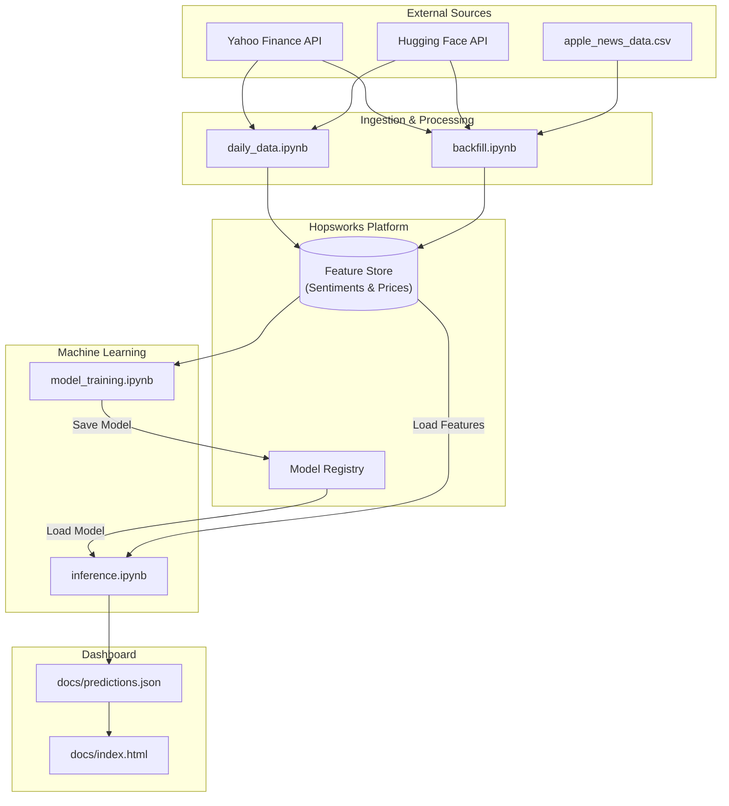

# AAPL stock price predictor using sentiment analysis

By Sam Barati Bakhtiiari and Joel Maharena. Project for ID2223. 

#### Aim of the project
The aim of this project was to build an ML-pipeline that uses sentiment analysis to output a prediction of tomorrows opening trading price for AAPL.
We display this information in a github page that is updated whenever a new inference is made. See screenshots or follow the link below. 
https://idguafi.github.io/nlp-stock-prediction/ 


#### A note on why this project differs from our original proposition

We originally aimed to build a general sentiment analysis predictor that ingested reddit sentiments via PRAW and predicted whether or not the price of said stock would see a 1% uptick or not. 
This, however, we realised was not possible due to the reddit API being unavailable to us. We tried applying for a token, but were denied access. 
Furthermore, it would be hard to find historical sentiment data for ALL stocks, which is another problem with our idea... 
##### TLDR: 
The original idea was too ambitious/unfeasible, so we settled to make the best of the situation by scaling back the scope, and applying a similar idea to the AAPL stock as a proof of concept. Instead of predicting the 1% increase, we instead decided to predict the following days opening price.

# Technologies, data, model, training and inference

#### Technologies used

For the feature store/model registry we used hopsworks (cheers, jim!). Sentiment analysis model was finbert via huggingface, which can be found here: https://huggingface.co/ProsusAI/finbert. Lastly, we used github pages to display our model's predictions. 

#### Historical (static) data and training

The historical datasets used were: 

1. https://www.kaggle.com/datasets/frankossai/apple-stock-aapl-historical-financial-news-data which consisted of apple articles with corresponding sentiment scores
2. yfinance historical stock prices

This data was then backfilled into a hopsworks feature store and was later used to train our xgboost model. 

#### Dynamic data - yfinance articles

For the dynamic data source, we ingested daily articles about AAPL via the yfinance library, along with todays opening price for plotting and accuracy measurement. 
The ingested articles were then fed through the FinBert NLP model that scored the sentiment and sentiment polarity for today which was then used to predict tomorrows price. 


# Model performance 

The model is slightly off when it comes to the opening price predictions, as shown by the gap between the predicted opening price and the actual opening price. 
Why is this the case? Our best guess is that it's due to the fact that AAPL traded at much lower prices for a majority of the data that we have access to. 
Looking at the apple stock price in january of 2024 compared to december the same year (which is the last year we had access to) you can see an astronimical leap from trading at 180 USD to 253 USD. 

I can hear you thinking that we easily could have accessed stock data for 2025 as well, and that is true, but the issue is that we didn't have historical sentiment for 2025 to go along with it, which means that it wouldn't have worked within the scope of our project.

##### TLDR: 
Major shift in prices in 2024, sustained at that level in 2025/26. 
Limited data at that price with associated sentiment score which affects predictive quality.


# High level architecture


# How to Run This Yourself

Follow these steps to set up the project locally and run the prediction pipeline.

#### 1. Prerequisites
- **Python 3.8+** installed.
- **Hopsworks Account**: You need a [Hopsworks](https://www.hopsworks.ai/) account (serverless is free) to manage the Feature Store and Model Registry.

#### 2. Installation
Clone the repository and install the dependencies:

```bash
pip install -r requirements.txt
```

#### 3. API Key Configuration
The scripts require a Hopsworks API Key to authenticate. 
1. Generate an API Key in your Hopsworks project settings.
2. When you run the scripts, the `hopsworks.login()` function will prompt you to enter your API Key.
3. **(Optional)** To avoid manual entry, you can create a .env file in the root directory or export it as an environment variable:
   ```bash
   export HOPSWORKS_API_KEY='your_api_key_here'
   ```


### 4. Project Workflow
The core logic is divided into Jupyter notebooks located in the notebooks directory. For a complete deployment, they are typically executed in this order:

1.  **`backfill.ipynb`**: Populates the Feature Store with historical stock price and sentiment data.
2.  **`daily_data.ipynb`**: Designed to run daily (e.g., via GitHub Actions) to fetch the latest data and update the Feature Store.
3.  **`model_training.ipynb`**: Trains the XGBoost model using data from the Feature Store and saves it to the Model Registry.
4.  **`inference.ipynb`**: Loads the latest model, fetches batch data, and performs stock price predictions.
